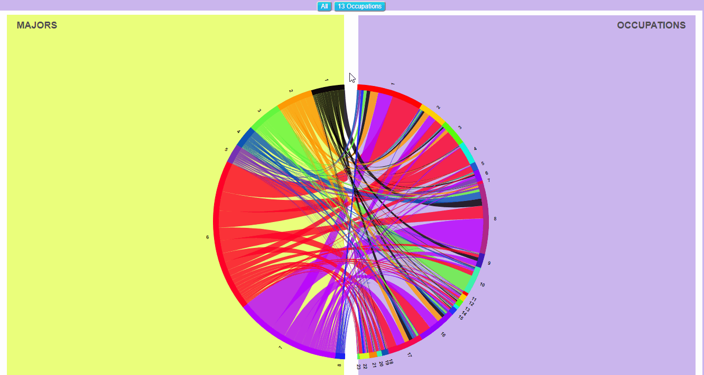

Interactive Chord Diagram.
---



HTML File.
---
index.html
```html
<!-- Created by Javier Rodriguez on 09/15/2017 -->
<!DOCTYPE html>
<html>
 <!-- HTML head -->
	<head>
		<!-- ASCII code for web page -->
		<meta charset="utf-8">

		<!-- CSS files -->
		<link rel="stylesheet" type="text/css" href="text.css">
		<link rel="stylesheet" type="text/css" href="buttons.css">
		<link rel="stylesheet" type="text/css" href="squares.css">

		<script src="http://ajax.googleapis.com/ajax/libs/jquery/1.11.1/jquery.min.js"></script>
		
		<!-- Script to generate Chord Diagram -->
		<script src="ChordDiagram.js"></script>

		<!-- Library needed to generate chart D3 -->
		<script src="https://d3js.org/d3.v3.js"></script>
		
		<!-- Website Style-->
		<style type="text/css">
			body{
				font-family:'Open Sans', sans-serif;
				font-size: 9px; 
				font-weight: bold;
				color: #525252;
				text-align: center;
				background: #CAB5ED;
			}

			path.chord{
				fill-opacity: .80;
			}
		</style>
		
		<!-- Web page title -->
		<title>Chord Diagram</title>
	</head>

<!-- HTML body -->
	<body>
		<div class="Groups">
			<p id="G1">G1</p>
			<p id="G2">G2</p>
		</div>
		<div class=Squares>
			<div id="Main_Square">
				<svg id="ChordDiagram"; style="margin-top: 10px; margin-bottom: 10px;"></svg>
				<div id="G1_Square"></div>
				<dir id="G2_Square"></dir>
			</div>
		</div>
		<div class="Button">
			<button id="G1_8"; onclick="buttonId()">All</button>
			<button id="G2_13"; onclick="buttonId()">13 G2</button>
		</div>
	</body>
</html>
```

CSS Files.
---
text.css
```css
.Groups{
	font-size: 18px;
	font-style: "Arial";
	text-transform: uppercase;
	color: #525252;
}

#G1{
	position: absolute;
	top: 5%;
	left: 10%;
}

#G2{
	position: absolute;
	top: 5%;
	right: 10%;
}
```
buttons.css
```css
button{
	background-image: linear-gradient(#28D5EE, #20A3E3);
	background-color: #28D5EE;
	border-radius: 5px;
	cursor: white;
	color: white;
	font-family: "Arial";
	font-size: 12px;
}

#G1_8{
	position: relative;
	top: 10px;
}

#G2_13{
	position: relative;
	top: 10px;
}
```
squares.css
```css
#Main_Square{
	position: absolute;
	background: white;
	width: 84%;
	height: 800px;
	left: 8%;
	top: 5%;
	z-index: -2;
}

#G1_Square{
	position: absolute;
	background: #EAFF7B;
	width: 48%;
	height: 98%;
	left: 1%;
	top: 1%;
	z-index: -1;
}

#G2_Square{
	position: absolute;
	background: #CAB5ED;
	
	height: 98%;
	left: 51%;
	right: 1%;
	top: 0%;
	z-index: -1;
}
```
JavaScript Files
---
chorddiagram2.js
```javascript
/* Created by Javier Rodriguez on 09/15/2017 */
let dataArray=[["degfield","1","2","3","4","5","6","7","8","9","10","11","12","13","14","15","16","17","18","19","20","21","22","23","24"],
	      ["1", 873, 239, 50, 58, 96, 30, 17, 293, 47, 98, 17, 88, 23, 95, 48, 465, 249, 91, 95, 37, 132, 87, 9, 3237],
	      ["2", 181, 51, 17, 46, 107, 6, 8, 72, 11, 30, 4, 42, 11, 11, 17, 72, 66, 19, 18, 11, 40, 27, 4, 871],
	      ["3", 268, 54, 21, 451, 11, 5, 2, 63, 118, 10, 1, 10, 23, 18, 4, 87, 68, 0, 35, 7, 16, 26, 3, 1301],
	      ["4", 32, 23, 9, 1, 1, 4, 4, 26, 12, 4, 5, 4, 4, 2, 13, 33, 26, 0, 4, 0, 2, 2, 2, 213],
	      ["5", 709, 297, 81, 14, 17, 61, 33, 316, 584, 49, 13, 31, 66, 3, 53, 513, 332, 0, 11, 16, 20, 42, 6, 3267],
	      ["6", 25, 9, 14, 1, 1, 1, 1, 6, 51, 5, 1, 1, 4, 1, 2, 22, 22, 0, 1, 5, 6, 5, 0, 184],
	      ["7", 411, 151, 951, 62, 11, 22, 8, 109, 34, 24, 9, 29, 14, 15, 20, 140, 217, 3, 21, 76, 35, 49, 10, 2421],
	      ["8", 22, 3, 0, 0, 2, 3, 0, 8, 0, 1, 1, 0, 38, 3, 9, 10, 7, 0, 3, 2, 8, 2, 0, 122],
     	      ["9", 524, 228, 88, 37, 24, 114, 26, 4171, 126, 136, 34, 74, 57, 57, 135, 354, 452, 15, 51, 38, 77, 85, 17, 6920],
	      ["10", 1143, 231, 672, 1628, 65, 25, 20, 248, 70, 61, 18, 37, 45, 33, 24, 372, 211, 5, 174, 124, 151, 140, 31, 5528],
	      ["11", 465, 114, 189, 286, 15, 14, 3, 68, 32, 29, 6, 29, 15, 15, 8, 250, 115, 4, 79, 94, 107, 56, 3, 1996],
              ["12", 115, 73, 39, 8, 5, 38, 23, 281, 52, 24, 9, 19, 27, 5, 33, 119, 131, 0, 6, 2, 12, 21, 11, 1053],
              ["13", 6, 6, 1, 0, 1, 15, 0, 31, 2, 2, 5, 1, 3, 1, 7, 9, 17, 0, 0, 0, 0, 0, 0, 107],
	      ["14", 26, 14, 6, 1, 0, 6, 47, 10, 2, 3, 0, 7, 2, 3, 3, 22, 20, 0, 7, 3, 3, 5, 0, 190],
	      ["15", 31, 26, 8, 2, 3, 4, 5, 72, 38, 8, 1, 4, 16, 1, 8, 28, 48, 0, 2, 3, 5, 2, 2, 317],
              ["16", 45, 20, 10, 2, 1, 12, 5, 82, 13, 11, 6, 15, 12, 3, 9, 60, 78, 0, 3, 4, 6, 10, 1, 408],
	      ["17", 4, 4, 2, 0, 0, 1, 1, 9, 0, 2, 0, 1, 0, 0, 1, 4, 5, 0, 0, 0, 0, 0, 0, 34],
	      ["18", 186, 92, 54, 31, 143, 27, 8, 202, 16, 213, 29, 19, 30, 13, 41, 132, 98, 11, 16, 9, 29, 27, 7, 1433],
	      ["19", 225, 138, 311, 67, 24, 12, 8, 443, 23, 29, 3, 18, 18, 12, 16, 124, 107, 1, 12, 25, 17, 35, 6, 1674],
	      ["20", 3, 0, 1, 0, 0, 0, 0, 0, 0, 0, 0, 0, 0, 1, 0, 0, 1, 0, 1, 0, 2, 3, 3, 15],
              ["21", 197, 118, 53, 20, 17, 65, 15, 837, 48, 179, 23, 36, 33, 9, 38, 174, 213, 2, 14, 8, 24, 27, 10, 2160],
              ["22", 9, 6, 0, 1, 1, 1, 3, 25, 8, 16, 7, 0, 7, 1, 8, 11, 19, 0, 3, 2, 0, 4, 1, 133],
	      ["23", 79, 38, 34, 6, 3, 67, 6, 67, 26, 14, 2, 16, 12, 3, 11, 61, 55, 4, 14, 10, 11, 10, 5, 554],
   	      ["24", 89, 34, 30, 7, 2, 230, 2, 79, 21, 20, 7, 32, 12, 14, 20, 70, 91, 1, 20, 18, 15, 41, 6, 861],
	      ["25", 385, 124, 153, 120, 398, 19, 5, 297, 27, 117, 18, 26, 29, 8, 21, 184, 136, 4, 47, 22, 77, 56, 9, 2282],
	      ["26", 11, 1, 2, 3, 1, 0, 0, 7, 1, 41, 2, 1, 1, 0, 1, 0, 1, 0, 0, 3, 0, 0, 0, 76],
	      ["27", 57, 40, 9, 3, 10, 56, 5, 69, 3, 36, 8, 8, 16, 7, 20, 46, 76, 0, 6, 10, 9, 5, 5, 504],
	      ["28", 8, 7, 0, 1, 4, 12, 4, 5, 1, 5, 0, 27, 3, 1, 3, 6, 23, 0, 2, 2, 1, 5, 9, 129],
	      ["29", 182, 90, 20, 4, 4, 413, 17, 185, 19, 54, 18, 43, 14, 11, 44, 80, 199, 0, 12, 5, 13, 16, 4, 1447],
	      ["30", 780, 536, 196, 82, 73, 96, 67, 334, 65, 77, 18, 100, 85, 25, 60, 531, 366, 6, 51, 34, 61, 94, 51, 3788],
	      ["31", 226, 38, 1, 31, 1, 4, 0, 5, 7, 2, 0, 2, 2, 4, 1, 16, 18, 0, 51, 5, 9, 6, 0, 429],
	      ["32", 5, 1, 0, 0, 0, 0, 0, 1, 0, 0, 0, 0, 0, 1, 2, 6, 5, 0, 7, 19, 11, 11, 1, 70],
	      ["33", 1, 0, 0, 0, 0, 0, 0, 0, 0, 1, 0, 0, 0, 0, 0, 1, 0, 0, 0, 0, 1, 0, 0, 4],
	      ["34", 100, 35, 14, 30, 2, 4, 0, 31, 4, 6, 2, 24, 3, 6, 6, 39, 39, 0, 6, 30, 18, 298, 15, 712],
	      ["35", 279, 160, 110, 35, 3, 61, 19, 617, 398, 49, 17, 39, 109, 13, 73, 265, 304, 3, 43, 20, 43, 34, 6, 2700],
	      ["36", 440, 165, 65, 16, 40, 98, 16, 357, 31, 2419, 148, 27, 37, 12, 80, 260, 315, 1, 20, 12, 35, 36, 17, 4647],
	      ["37", 1142, 800, 482, 76, 30, 52, 28, 276, 70, 75, 24, 45, 125, 44, 78, 767, 665, 3, 36, 39, 70, 81, 30, 5038],
    	      ["38", 21, 11, 2, 2, 0, 1, 6, 22, 2, 3, 1, 3, 10, 0, 2, 22, 18, 1, 3, 2, 3, 1, 7, 143]];

generateChordDiagram(dataArray,"G1_8");										//Function call.

////////////////////////////////////////////////////////
//FUNCTION NAME: Get Matrix Reduce G2s.        	      //
//FUNCTION PURPOSE: To reduce G2s from matrix.        //
//					              //
//PARAMETERS: 1. dataArray - Array of objects 2D.     //
//	      2. matrix. - Array of objects 2D.	      //
// 	      3. chordDiagramType - String variable.  //
//RETURN: matrix. 			              //
//AUTHOR: Javier Rodriguez.			      //
//DATE: 10/25/2017				      //
////////////////////////////////////////////////////////
function getMatrixReduceG2s(dataArray,matrix,chordDiagramType){
	getMatrixReduceG1s(dataArray, matrix);
	let newMatrix = [];
	let count = 0;
	let dataArrayIndexes=[[1,2],[3,4,5],[6,7,8,9],[10],[11,12,13,14,15],[16],[17],[18],[19],[20],[21],[22],[23]];
	
	while(matrix[0][count]===0)
		count++;

	//Initializing array.	
	for(let i=0; i<dataArrayIndexes.length+(matrix.length-count); i++){
		newMatrix[i]=[];
		for(let j=0; j<dataArrayIndexes.length+(matrix.length-count); j++)
			newMatrix[i][j]=0;
	}

	//Reformatting matrix. - 10/30/2017
	for(let i=0; i<dataArrayIndexes.length; i++){
		let j=dataArrayIndexes.length;
		let dataArrayIndexesX = 0;
		for(let m=count; m<matrix.length; m++){
			while(dataArrayIndexes[i][dataArrayIndexesX]){
				newMatrix[i][j]+=matrix[dataArrayIndexes[i][dataArrayIndexesX]-1][m];
				dataArrayIndexesX++;
			}
			newMatrix[j][i]=newMatrix[i][j];
			j++;
			dataArrayIndexesX=0;
		}
	}

	//New matrix.
	matrix = newMatrix;

	return matrix;	
}

////////////////////////////////////////////////////////
//FUNCTION NAME: Get Matrix Reduce G1s.       	      //
//FUNCTION PURPOSE: To reduce majors from matrix.     //
//		                 	 	      //
//PARAMETERS: 1. dataArray - Array of objects 2D.     //
//	      2. matrix. - Array of objects 2D.       //
//RETURN: matrix. 				      //
//AUTHOR: Javier Rodriguez.			      //
//DATE: 10/27/2017				      //
////////////////////////////////////////////////////////
function getMatrixReduceG1s(dataArray, matrix){
	let dataArrayIndexes = [[8,31,32,33,34],[5,9,17,27,30,38],[1,2,3,6,7,10,11,18,19,25,26],[14,20,24,28,29],[4,13,16,21,22],[36],[37],[12,15,23,35]];
	let dataArrayIndexesY=0;
	let dataArrayIndexesX = 0;
	let dataArrayCount = 0;

	//Initializing array.
	for(let i=0; i<(dataArray[0].length-2)+(dataArrayIndexes.length); i++){
		matrix[i]=[];
		for(let j=0; j<dataArrayIndexes.length+(dataArray[0].length-2); j++)
			matrix[i][j]=0;
	}

	//Getting data from excel array.
	for(let i=0; i<dataArray[0].length-2; i++){
		let dataArrayIndexesY=0;
		dataArrayCount++;
		for(let j=dataArray[0].length-2; j<matrix[0].length; j++){
			while(dataArrayIndexes[dataArrayIndexesY][dataArrayIndexesX]){
				if(dataArray[dataArrayIndexes[dataArrayIndexesY][dataArrayIndexesX]][dataArrayCount]!==undefined)
					matrix[i][j]+=dataArray[dataArrayIndexes[dataArrayIndexesY][dataArrayIndexesX]][dataArrayCount];
				matrix[j][i]=matrix[i][j];
				dataArrayIndexesX++;
			}
		dataArrayIndexesX=0;;
		dataArrayIndexesY++;
		}
	}

	return matrix;
}

///////////////////////////////////////////////////
//FUNCTION NAME: Add Empty Rows.	 	 //
//FUNCTION PURPOSE: To add empty rows to matrix. //
//						 //
//PARAMETERS: 1. matrix - Array of Objects. 2D	 //
//RETURN: matrix 	  			 //
//AUTHOR: Javier Rodriguez.			 //
//DATE: Unknown.				 //
///////////////////////////////////////////////////
function addEmptyRows(matrix){
	const newMaxRows = matrix.length+1;	//Int Constant. New maximun of rows.
	let count = newMaxRows-2;		//Int Variable. Where data is.
	let nRows = 0;				//Int Variable. Number of rows.

	//Initializing cells.
	for(let i=newMaxRows; i>(newMaxRows-2); i--){
		matrix[i]=[]
		for(let j=0; j<matrix[0].length;j++)
			matrix[i][j]=0;
	}
	
	//Calculating where to break.
	while(matrix[nRows][0]===0)
		nRows++;

	//Moving cells.
	while(count>=nRows){
		matrix[count+1]=matrix[count].slice();
		count--;
	}
 
	//Cleaning middle row.
	matrix[count+1]=matrix[newMaxRows].slice();

	return matrix;
}

///////////////////////////////////////////////////
//FUNCTION NAME: Add Empty Cols.		 //
//FUNCTION PURPOSE: To add empty columns. 	 //
//						 //
//PARAMETERS: 1. matrix - Array of Objects 2D.   //
//RETURN: matrix 	  			 //
//AUTHOR: Javier Rodriguez.			 //
//DATE: Unknown.				 //
///////////////////////////////////////////////////
function addEmptyCols(matrix){
	const newMaxCols = matrix[0].length+1;	//Int Constant. New number of cols.
	let rowCount = newMaxCols-2;		//Int Variable. Counts numbers of rows.
	let colCount = 0;			//Int Variable. Counts nunbers of cols.
	let zCols = 0;

	while(matrix[0][zCols]===0)
		zCols++;

	//Adding to cells at the end of matrix.
	for(let i=0; i<matrix.length; i++)
		for(let j=newMaxCols; j>(newMaxCols-2); j--)
			matrix[i][j]=0;

	//Moving values inside matrix.
	for(let i=0; i<matrix.length; i++){
		for(j=matrix.length-2; j>=zCols; j--)
			matrix[i][j+1] = matrix[i][j];
		matrix[i][j+1]=0;
	}

	return matrix;
}

///////////////////////////////////////////////////
//FUNCTION NAME: Separation Between.		 //
//FUNCTION PURPOSE: To define separation between //
//		    halves.		 	 //
//						 //
//PARAMETERS: 1. sBH - Integer.			 //
//	      2. matrix - 2D array of objects.	 //
//RETURN: matrix.			         //
///////////////////////////////////////////////////
function separationBetween(sBH,matrix){
	let zRows = 0;		//Int Variable - Blank rows.

	//Calculating last cells with zero.
	while(matrix[zRows][0]===0)
		zRows++;
	zRows--;

	//Setting values.
	matrix[zRows][matrix[0].length-1]=sBH;
	matrix[matrix.length-1][zRows]=sBH;

	return matrix;
}

///////////////////////////////////////////////////
//FUNCTION NAME: Fill Name.	        	 //
//FUNCTION PURPOSE: To fill names for diagram.   //
//						 //
//PARAMETERS: 1. names - Array of Strings.	 //
//	      2. dataArray - Array of objects 2D.//
//	      3. chordDiagramValues - String.	 //
//	      4. occ_13 - Array of Strings.	 //
//	      5. majors_8 - Array of Strings.	 //
//RETURN: Nothing.  				 //
//AUTHOR: Javier Rodriguez.		         //
//DATE: Unknown.			         //
///////////////////////////////////////////////////
function fillName(names, dataArray, chordDiagramValues, g2_13, g1_8){
	let count = 0;						//Int Variable - Counter.

	//Filling array with first names.
	if(chordDiagramValues!=="G2_13")
		for(let i=1; i<dataArray[0].length-1; i++){
			names[count]=dataArray[0][i];
			count++;
		}
	else { for(let i=0; i<g2_13.length; i++){
				names[i]=g2_13[i];				
			}
			count=g2_13.length;
		}	

	//Bottom separation between halves.
	names[count]="";
	count++;

	for(let i=1; i<=g1_8.length; i++){
	  	names[count]=g1_8[g1_8.length-i];
		count++;
	}

	//Top separation between halfves.
	names[count]="";

	return names;
}

///////////////////////////////////////////////////
//FUNCTION NAME: Get Population.	         //
//FUNCTION PURPOSE: To calculate the total pop.  //
//						 //
//PARAMETERS: 1. matrix - Array of objects 2D.   //
//RETURN: respondent - Int variable.		 //
//AUTHOR: Javier Rodriguez.			 //
//DATE: Unknown.				 //
///////////////////////////////////////////////////
function getPopulation(matrix){
	let respondent = 0;			//Int variable - total population.
	let count = 0;

	while(matrix[0][count]===0)
		count++;

	//Adding values in cells.
	for(let i=0; i<count; i++)
		for(let j=0; j<matrix.length; j++)
			respondent += matrix[i][j];

	return respondent;
}

///////////////////////////////////////////////////
//FUNCTION NAME: Modifying Colors.		 //
//FUNCTION PURPOSE: To Modify array of colors.   //
//						 //
//PARAMETERS: 1. aColor - Array of strings.	 //
//	      2. matrix - Array of objects 2D.	 //
//RETURN: Nothing.  		                 //
//AUTHOR: Javier Rodriguez.			 //
//DATE: Unknown.				 //
///////////////////////////////////////////////////
function modifyingColors(aColor,matrix){
	let zRows = 0;		//Int Variable - Rows that star with zero.

	//Locating last row.
	while(matrix[zRows][0]===0)				
		zRows++;
	zRows--;;

	//Adding Blank Values.
	aColor[zRows] = "#FFFFFF"; 
	aColor[matrix.length-1] = "#FFFFFF";
	
	return aColor;
}

///////////////////////////////////////////////////
//FUNCTION NAME: Button ID.	                 //
//FUNCTION PURPOSE: To create a chard according  //
//	            to user selection.		 //
//						 //
//PARAMETERS: None.		              	 //
//RETURN: Nothing.  				 //
//AUTHOR: Javier Rodriguez.			 //
//DATE: Unknown.				 //
///////////////////////////////////////////////////
function buttonId(){
	let e = window.event;
	let bttn = e.target || e.srcElement;
	generateChordDiagram(dataArray,bttn.id);		//Function call.
	//throw new Error('This is not an error. This is just to abort javascript');	
}

////////////////////////////////////////////////////////
//FUNCTION NAME: Generate Chord Diagram.	      //
//FUNCTION PURPOSE: To Display Chord Diagram.         //
//						      //
//PARAMETERS: 1. dataArray - Array of Objects 2D.     //
//	      2. chordDiagramValues - String variable.//
//RETURN: Nothing. 				      //
//AUTHOR: Javier Rodriguez.			      //
//DATE: Unknown.				      //
////////////////////////////////////////////////////////
function generateChordDiagram(dataArray,chordDiagramValues){
let screenWidth = $(window).width(); 			                  //Int Variable. Screen width.
let margin = {left: 100, top: 100, right: 100, bottom: 100};	  	  //Array of Objects. Chart margin.
let width =  Math.min(screenWidth, 900) - margin.left - margin.right;	  //Int Variable. Chart width.
let height = Math.min(screenWidth, 937)*5/6 - margin.top - margin.bottom; //Int Variable. Chart height.
let outerRadius = Math.min(width, height) * 0.5 - 30;			  //Int Variable. Chart outer radius.
let innerRadius = outerRadius - 10;					  //Int Variable. Chart inner radius.
let opacityDefault = 1.0;    						  //Int Variable. Chart chords opacity.
let opacityLow = 0.00;
let names = [];
let matrix = [];							  //Array to handle matrix.
	let aColor = ["FF0000","FFD000","69FF00","00FFD8","0069FF",	  //Array to store html colors.
		      "6C00FF","FF0074","B22A89","4009B8","3DF7B9",			
		      "FF2A00","FFF700","00FF03","00F8FF","004AFF",
		      "9600FF","FF004E","912AB2","0432B8","3DF770",
		      "FF7400","DDFF00","00FF58","00CDFF","0008FF",
		      "B900FF","FF0027","762AB2","0456B8","65F73D",
		      "FF9600","BSFF00","00FF7F","00AAFF","3A00FF",
let g2_13 = ["1","2","3","4","5","6","7","8","9","10","11","12","13"];
let g1_8 = ["1","2","3","4","5","6","7","8"];

//Generating clean matrix.
if(chordDiagramValues==="G1_8"){
	d3.select("svg").selectAll("*").remove();
	getMatrixReduceG1s(dataArray,matrix);
} else {
	d3.select("svg").selectAll("*").remove();
	matrix = getMatrixReduceG2s(dataArray,matrix,chordDiagramValues);
}

//Calculating space between halves and rotation.
let totalPopulation = getPopulation(matrix);	 		      //Int variable - total population.
let emptyPercentage = 0.03;					      //Double variable - empty percentage. 
let emptyStroke = Math.round(totalPopulation*emptyPercentage);	      //Double variable - needed population to create effect.
let offset = Math.PI * (emptyStroke/(totalPopulation+emptyStroke))/2; //Double variable - rotation needed.

addEmptyRows(matrix);					      //Function call.
addEmptyCols(matrix);					      //Function call.
separationBetween(emptyStroke,matrix);			      //Function call.
fillName(names,dataArray,chordDiagramValues,g2_13,g1_8);      //Function call.
modifyingColors(aColor,matrix);				      //Function call.

////////////////////////////////////////////////////////
//FUNCTION NAME: Start Angle.			      //
//FUNCTION PURPOSE: To calculate new angle with offset//
//						      //
//PARAMETERS: 1. d - Object.			      //
//RETURN: Nothing. 				      //
//AUTHOR: Javier Rodriguez.			      //
//DATE: Unknown.				      //
////////////////////////////////////////////////////////
function startAngle(d) {return d.startAngle + offset;}


////////////////////////////////////////////////////////
//FUNCTION NAME: End Angle.			      //
//FUNCTION PURPOSE: To calculate new angle with offset//
//						      //
//PARAMETERS: 1. d - Object.			      //
//RETURN: Nothing. 				      //
//AUTHOR: Javier Rodriguez.			      //
//DATE: Unknown.				      //
////////////////////////////////////////////////////////
function endAngle(d) {return d.endAngle + offset; }	

//Drawing.
let svg = d3.select("svg")				//SVG object.
.attr("width", (width + margin.left + margin.right))	//Defining width.
.attr("height", (height + margin.top + margin.bottom));	//Defining height.

let wrapper = svg.append("g").attr("class", "chordWrapper")
.attr("transform", "translate(" + (width / 2 + margin.left) + "," + (height / 2 + margin.top) + ")");

let chord = d3.layout.chord()	//Formatting chords.
.sortSubgroups(d3.ascending) 	//Sorting chords according to %.
.sortChords(d3.descending)	//Which chord goes on top.
.matrix(matrix);		//Matrix.

let arc = d3.svg.arc()		//Formatting chart arc.
.innerRadius(innerRadius)	//Chart inner radius.
.outerRadius(outerRadius)	//Chart outer radius.
.startAngle(startAngle)
.endAngle(endAngle);

let path = d3.svg.chord()	//Formatting path.
.radius(innerRadius)		//Chart radius.
.startAngle(startAngle)
.endAngle(endAngle);

let fill = d3.scale.ordinal()	//Adding color to chords.
.domain(d3.range(names.length))	//Number of groups.
.range(aColor);			//Range of available colors.

let g = wrapper.selectAll("g.group")  //Putting all together.
.data(chord.groups)
.enter().append("g")
.attr("class", "group")
.on("mouseover",fade(opacityLow))
.on("mouseout", fade(opacityDefault));

g.append("path")				         //Displaying arc.
.style("stroke", function(d) { return fill(d.index); })
.style("fill", function(d) { return fill(d.index); })
.attr("d", arc);

g.append("text")
.each(function(d) { d.angle = ((d.startAngle + d.endAngle) / 2)+ offset;})  //Puts text around diagram.
.attr("dy", "0.35em")							    //Centers text.
.attr("class", "titles")
.attr("text-anchor", function(d) { return d.angle > Math.PI ? "end" : null; })	//Determines where text starts.
.attr("transform", function(d,i) { 
	let c = arc.centroid(d);
	return "rotate(" + (d.angle * 180 / Math.PI - 90) + ")"	+ "translate(" + (innerRadius + 20) + ")"+ (d.angle > Math.PI ? "rotate(180)" : "")
})
.text(function(d,i) { return names[i]; });

let chords = wrapper.selectAll("path.chord")
.data(chord.chords)
.enter().append("path")
.attr("class", "chord")
.style("stroke", "none")
.style("fill", function(d,i) { return fill(d.target.index); })
.style("opacity", opacityDefault)
.attr("d", path)
.on("mouseover", fadeOnChord)
.on("mouseout", fade(opacityDefault));	
		
//Arcs
g.append("title")	
.text(function(d, i) { if(names[i]!=="") return Math.round(d.value) + " people in " + names[i];});
	
//Chords
chords.append("title")
.text(function(d) {if(names[d.target.index]!=="") return [Math.round(d.source.value), " people from ", names[d.target.index], " to ", names[d.source.index]].join(""); 
});

////////////////////////////////////////////////////////
//FUNCTION NAME: Fade.				      //
//FUNCTION PURPOSE: To filter out other chords.	      //
//						      //
//PARAMETERS: 1. opacity - Double variable.	      //
//RETURN: Nothing. 				      //
//AUTHOR: Javier Rodriguez.			      //
//DATE: Unknown.				      //
////////////////////////////////////////////////////////
function fade(opacity) { return function(d, i){ if(names[i]!=="")
	wrapper.selectAll("path.chord")
	       .filter(function(d){return d.source.index !==i && d.target.index !== i})
	       .transition()
	       .style("opacity", opacity);
	};
}

////////////////////////////////////////////////////////
//FUNCTION NAME: Fade On Chord.			      //
//FUNCTION PURPOSE: To everything out but current     //
//		    chord. 			      //
//	                        		      //
//PARAMETERS: 1. d - Object.          		      //
//RETURN: Nothing. 				      //
//AUTHOR: Javier Rodriguez.			      //
//DATE: Unknown.				      //
////////////////////////////////////////////////////////
function fadeOnChord(d) {
	var chosen = d;
	if(names[d.source.index]!=="")
	wrapper.selectAll("path.chord")
		.transition()
		.style("opacity", function(d) {return d.source.index === chosen.source.index && d.target.index === chosen.target.index ? opacityDefault : opacityLow;
		});
	}	
}
```
